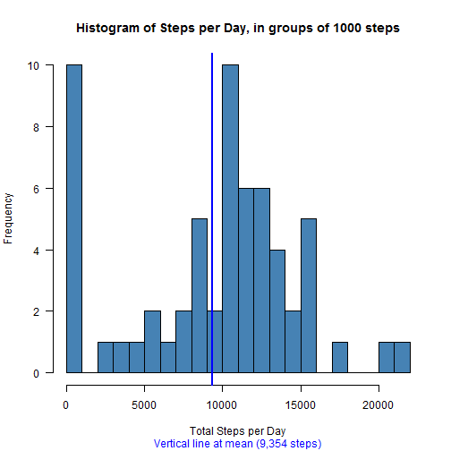
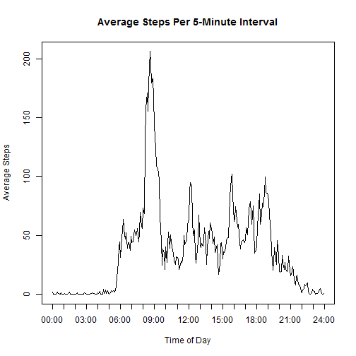
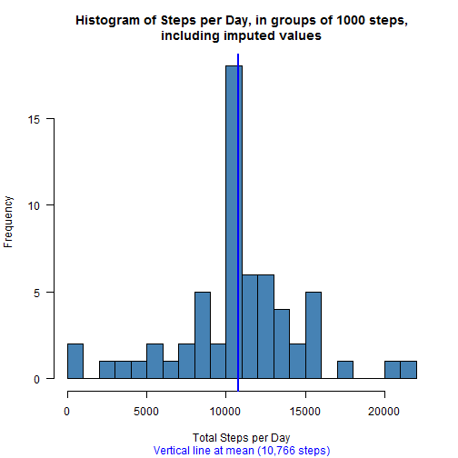
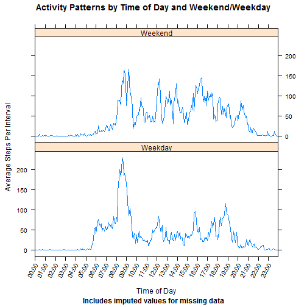

# Reproducible Research: Peer Assessment 1
David E.H. Dailey

In this project, I am examining data from an activity monitor that recorded the number of steps taken by an individual volunteer in 5-minute intervals over a period of two months in late 2012.  I have been asked to address a number of specific questions related to this dataset.

## Loading and preprocessing the data

__Load the data__

```r
## Prepare the workspace by loading packages
## require() works like library() but returns TRUE if the package loads successfully
## stopifnot() halts execution if the condition fails (the script cannot load the required package)
stopifnot( require( lattice ) )
```

```
## Loading required package: lattice
```

```r
stopifnot( require( reshape2 ) )
```

```
## Loading required package: reshape2
```

```r
## Load data from zip file which is expected to exist in working directory
zipFile <- 'activity.zip'
if( !file.exists( zipFile ) ) {
  stop( sprintf( 'Zip file %s not in working directory!', zipFile ) )
}
stepData <- read.csv( unz( zipFile, filename='activity.csv' ) )
```
 
-----
__Process/transform the data into suitable formats__

```r
## Apply data transformations.
stepData <- transform( stepData, Date        = as.Date( as.character( stepData$date ) ) )
stepData <- transform( stepData, DayOfWeek   = weekdays( Date ), stringsAsFactors=FALSE )
stepData <- transform( stepData, DayType     = factor( DayOfWeek %in% c( 'Saturday', 'Sunday' ), 
                                                       labels=c('Weekday', 'Weekend' ) ) )

## As coded in the original data file, the interval value induces gaps.  The
## intervals near noon are coded as 1150, 1155, 1200, 1205, and so forth.  I
## prefer to work with the number of minutes since midnight and the label them
## with a string variable with the "clock time".
## An alternative is to created an ordered factor using the given interval values and then assign
## prettier level labels.
stepData <- transform( stepData, MinuteOfDay = (60 * interval %/% 100) + (interval %% 100) )
stepData <- transform( stepData, IntervalTime = sprintf( '%02d:%02d', interval%/% 100, interval%% 100 ) )
```

## What is the mean total number of steps taken per day?

__Make histogram: total number of steps per day__

```r
## Must do some calculations first
stepsPerDay  <- tapply( stepData$steps, INDEX = list( stepData$Date ), FUN = sum, na.rm=TRUE )
valuesPerDay <- tapply( stepData$steps, INDEX = list( stepData$Date ), FUN = function( . ) sum( !is.na( . ) ) )
stepMean        <- mean( stepsPerDay, na.rm=TRUE )
stepMeanNonZero <- mean( stepsPerDay[ stepsPerDay > 0 ] )
stepMedian        <- median( stepsPerDay, na.rm=TRUE )
stepMedianNonZero <- median( stepsPerDay[ stepsPerDay > 0 ] )

par( las=1 )
hist( stepsPerDay, breaks=seq( 0, 1000*ceiling( max( stepsPerDay ) / 1000 ), by = 1000 ), 
      col='steelblue', xlab='Total Steps per Day', 
      main='Histogram of Steps per Day, in groups of 1000 steps' )
abline( v=stepMean, col='blue', lwd=2 )
title( sub=sprintf( 'Vertical line at mean (%s steps)', prettyNum( round( stepMean, 2), big.mark=',' ) ), col.sub='blue' )
```

 

-----
__Report mean and median steps per day__

Over the reporting period, a mean of 9,354 steps were recorded each day. The median number of steps per day is 10,395.

**Note:** The mean and median reported above include 8 days for which all observations were missing.  These days are recorded as having zero steps; these zero values will drag the mean and median downward.  Excluding days for which the total number of steps was zero, the mean number of steps per day is 10,766 and the median is 
10,765.


## What is the average daily activity pattern?

__Time series plot of daily activity__

```r
stepsPerInterval <- tapply( stepData$steps, INDEX = list( stepData$IntervalTime ), FUN = mean, na.rm=TRUE )
```

```r
plot( stepsPerInterval, type='l', xaxt='n', xlab='Time of Day', ylab='Average Steps' )
title( main='Average Steps Per 5-Minute Interval' )

## Label the x-axis at the hours
tt.index <- c( grep( ':00$', names( stepsPerInterval ) ), length( stepsPerInterval ) + 1 )
tt.label <- c( grep( ':00$', names( stepsPerInterval ), value=TRUE ), '24:00' )
axis( side=1, at=tt.index, labels=tt.label )
```

 

-----
__Interval with maximum average steps__


```r
mm.index <- which.max( stepsPerInterval )
mm.value <- stepsPerInterval[ mm.index ]
mm.label <- names( mm.value )
```

On average across the 61 days in the dataset, the maximum average number of steps occurs within the 5-minute interval beginning at 08:35.  The maxmimum average value is 206.17.  These averages are calculated by ignoring missing data within any given 5-minute interval.

## Imputing missing values

__Report number of missing values__

The dataset includes 2304 missing values for step counts within 5-minute intervals, out of 17568 observations in all.  We can assign plausible values for these missing data.  For each missing value, I will assign the mean value of observed counts within the same 5-minute interval across all days in the dataset.

-----
__Apply strategy for filling in missing values__

```r
## Strategy: fill in using mean of nonmissing values for the same interval.
## These mean values are already in stepsPerInterval, calculated earlier.
imputedValues <- with( stepData, 
                   ifelse( is.na( steps ), 
                           round( stepsPerInterval[match( IntervalTime, names( stepsPerInterval ) ) ], 2 ), 
                           steps ) )
## Add imputed values to the full dataset
stepData <- transform( stepData, StepImpute = imputedValues )
```

-----
__Create a new dataset with missing data filled in__

```r
## Create a new dataset equal to original dataset but with missing data filled in
stepFilled <- stepData
stepFilled$steps <- stepFilled$StepImpute
```

-----
__Histogram of steps per day including filled data; summarize differences from unfilled data__

```r
hist( filledPerDay <- with( stepFilled, tapply( steps, INDEX=list( Date ), FUN=sum ) ),
      col='steelblue', breaks=seq( 0, 1000 * ceiling( max( filledPerDay )/1000), by=1000 ),
      xlab='Total Steps per Day', 
      main='Histogram of Steps per Day, in groups of 1000 steps,\nincluding imputed values' )
filledMean   <- mean( filledPerDay, na.rm=TRUE )
filledMedian <- median( filledPerDay, na.rm=TRUE )
abline( v=filledMean, col='blue', lwd=2 )
title( sub=sprintf( 'Vertical line at mean (%s steps)', prettyNum( round( filledMean, 2), big.mark=',' ) ), col.sub='blue' )
```

 

Using step counts imputed for missing data within 5-minute intervals, a mean of 10,766 steps were recorded each day. The median number of steps per day is 10,766.  These mean and median values are notably different from the mean and median values computed before filling in plausible values for missing data, but are nearly identical to the mean and median values calculated while ignoring zero-step days (will all missing values).

Comparing the plausibly-filled data to the zero-filled data, the mean of the plausibly-filled data is much higher, and now is much closer to the value of the median.  Filling in plausible values-- and thereby removing the days where zero steps were recorded because all values were missing-- has resulted in a much more symmetric distribution.

## Are there differences in activity patterns between weekdays and weekends?

__Create factor variable for weekday/weekend__

```r
## The required factor variable is created as part of the original set of data transformations
## Summarize the variable here
with( stepFilled, summary( DayType ) )
```

```
## Weekday Weekend 
##   12960    4608
```

-----
__Panel plot of time series: Weekday and Weekend activity levels__

```r
## The required factor variable for weekends and weekdays is created above, under
## "Loading and Preprocessing the Data"
avgByIntervalType <- with( stepFilled, tapply( steps, INDEX= list( IntervalTime, DayType ), FUN=mean ) )
avgMelt <- melt( avgByIntervalType )
colnames( avgMelt ) <- c( 'TimeOfDay', 'DayType', 'Steps' ) 

## Prepare to label the x-axis at the hours
tt.index <- c( grep( ':00$', names( stepsPerInterval ) ), length( stepsPerInterval ) + 1 )
tt.label <- c( grep( ':00$', names( stepsPerInterval ), value=TRUE ), '24:00' )

xyplot( Steps ~ TimeOfDay | DayType, data=avgMelt, type='l', layout=c( 1, 2 ),
        scales = list( x = list( at=tt.index, labels=tt.label, rot=60 ) ),
        ylab='Average Steps Per Interval', xlab='Time of Day', 
        main='Activity Patterns by Time of Day and Weekend/Weekday', 
        sub='Includes imputed values for missing data' )
```

 

Based on the number of steps recorded during each 5-minute interval over this period of 61 days, this particular person appeared to be:

- Active earlier in the morning on weekdays than on weekends.
- More consistently active on weekend days than on days during the week.
- Active later into the evening on weekends than on weekdays.

